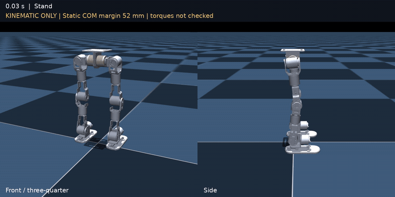
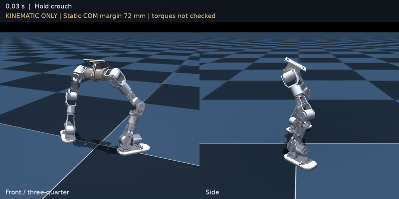

# legs_rl_lab

12-DOF 双足机器人 nlegs 的强化学习工程：Isaac Lab 训练 → MuJoCo 仿真验证 → ROS 2 实机部署。

## 任务

| 任务 | 用途 |
|---|---|
| `nlegs_flat` | 平地速度跟踪 |
| `nlegs_flat_static` | 行走与零速站稳 |
| `nlegs_flat_crouch` | 从站立或蹲姿起步的行走策略 |
| `nlegs_rough` | 台阶、坡面等地形上的速度跟踪，带难度课程 |
| `nlegs_mimic_crouch` | 跟踪下蹲参考动作 v3 |
| `nlegs_mimic_stand` | 跟踪起身参考动作 v2 |

## Mimic 参考动作

两组数据均为 100 Hz。下方展示参考动作的运动学回放，点击动图可查看 MP4。

**下蹲 v3 · 341 帧 · 3.40 s** — [数据](datasets/stand_to_crouch_v3/) · [MP4](datasets/stand_to_crouch_v3/preview.mp4)

[](datasets/stand_to_crouch_v3/preview.mp4)

**起身 v2 · 336 帧 · 3.35 s** — [数据](datasets/crouch_to_stand_v2/) · [MP4](datasets/crouch_to_stand_v2/preview.mp4)

[](datasets/crouch_to_stand_v2/preview.mp4)

训练配置已指向包内对应的 `motions/*.npz`，无需手动转换数据。下蹲末帧与起身首帧衔接；起身任务在参考结束后额外训练保持 5 s。

## 安装

先配置 [Isaac Lab](https://isaac-sim.github.io/IsaacLab/main/source/setup/installation/index.html) 和 RSL-RL。以下命令在训练环境中执行；MuJoCo 回放还需 `mujoco`，单任务回放的键盘控制需 `pynput`。

```bash
git clone git@github.com:katazen/legs_rl_lab.git
cd legs_rl_lab
python -m pip install -e source/legs_rl_lab
```

## 训练与回放

在仓库根目录运行，将 `--task` 替换为上表中的任务名。

```bash
# 训练
python scripts/rsl_rl/train.py --task nlegs_rough --headless --num_envs 4096

# 回放指定训练记录，并导出策略
python scripts/rsl_rl/play.py --task nlegs_rough --load_run '<训练目录名>' --num_envs 32 --real-time
```

训练结果位于 `logs/rsl_rl/<任务名>/<训练目录名>/`：`params/` 保存配置，回放后生成的 `exported/` 保存部署模型。策略权重需自行训练或另行提供。

### MuJoCo 验证

单任务回放，例如平地行走：

```bash
python source/legs_rl_lab/legs_rl_lab/tasks/nlegs_task/task/flat/sim2sim.py --run '<训练目录名>'
```

统一回放走路、下蹲、起身，模型路径读取 [common.yaml](deploy/rl_real_py/configs/common.yaml) 的 `tasks`：

```bash
python scripts/sim2sim.py
```

统一回放中，`1/2/3` 切换任务，`W/S A/D Q/E` 控制速度，`0` 停步，`P` 中断，`R` 重新验收。

## 实机部署

部署使用 ROS 2 Humble。先在 [common.yaml](deploy/rl_real_py/configs/common.yaml) 中配置走路、下蹲、起身三份模型路径，并准备各自的 `params/` 与 `exported/`。

在仓库根目录编译：

```bash
source /opt/ros/humble/setup.bash
(cd deploy/imu_ws && colcon build)
(cd deploy/control_ws && colcon build)
(cd deploy/rl_real_py && colcon build)
```

预检并启动：

```bash
./deploy/start_real.sh --check-only
./deploy/start_real.sh
```

启动后保持当前姿态，等待操作者选择任务。

| 功能 | 键盘 | 手柄 |
|---|---|---|
| 走路 / 下蹲 / 起身 | `1 / 2 / 3` | `LB+A / LB+X / LB+Y` |
| 停步 → 确认接地收脚 | `0` → `Enter` | `Start` → 再次 `Start` |
| 中断 | `P` | `B` |
| 重新验收 | `R` | `Back` |

实机运行前应扶稳或吊起机器人。`P/B` 不是断电急停；停止驱动可能使电机失力，先支撑机器人再执行：

```bash
./deploy/stop_real.sh
```

模型配置、任务切换条件与硬件操作见 [部署说明](deploy/README.md)。

## 目录

```text
datasets/                            # 动作参考、元数据与预览
scripts/                             # 训练、回放与数据生成
source/legs_rl_lab/legs_rl_lab/
├── assets/nlegs/                    # MJCF、USD、网格与机器人配置
├── actuators/                       # 执行器模型
├── tasks/nlegs_task/                # 行走任务
├── tasks/mimic_task/                # 下蹲与起身任务
└── utils/                          # 配置读取与部署参数导出
deploy/                              # ROS 2 驱动、策略节点与启动脚本
```

## 许可

Python 包声明为 Apache-2.0；各源码文件保留其 SPDX 许可声明。
